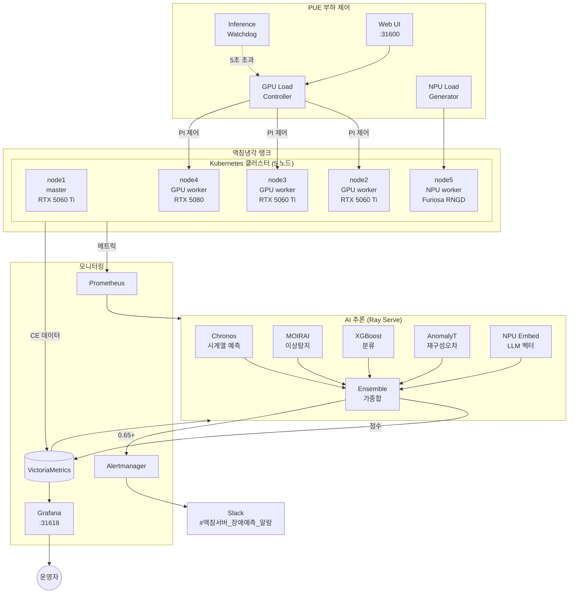

# 액침냉각 서버 AI 장애예측 시스템

> 액침냉각(Immersion Cooling) 탱크 내 5노드 Kubernetes 클러스터의 하드웨어 장애를 5-모델 AI 앙상블로 사전 예측하고, GPU/NPU 부하를 정밀 제어하여 PUE 전력효율을 측정하는 통합 플랫폼.

이 문서는 **이 프로젝트를 처음 보는 사람도 이해할 수 있도록** 작성되었습니다. 도메인 지식이 없어도 순서대로 읽으면 시스템이 무엇이고 어떻게 운영하는지 알 수 있습니다.

---

## 한 문단 소개

데이터센터의 서버는 메모리 칩(DRAM)에서 발생하는 **CE(Correctable Error)**가 누적되면 정정 불가능한 **UE(Uncorrectable Error)**로 진행되어 서버가 멈춥니다. 이 시스템은 액침냉각 탱크 안의 5대 서버(Kubernetes 클러스터)가 **자기 자신을 모니터링**하여 1분마다 하드웨어 메트릭을 수집하고, **5개의 AI 모델**로 분석합니다. 위험도가 임계치를 넘으면 **Slack 알림**을 보내 운영자가 즉시 대응할 수 있습니다. 동시에, GPU/NPU 부하를 정밀 제어하여 다양한 부하 수준에서의 **PUE(전력효율)를 측정**합니다.

---

## 왜 만들었는가

| 문제 | 영향 | 이 시스템의 해결 |
|---|---|---|
| 메모리 장애가 사전 경고 없이 발생 | 서비스 중단 | CE 패턴 변화로 수 시간 전 예측 |
| 액침냉각 PUE 측정에 정밀 부하 제어 필요 | 부하별 전력효율 비교 불가 | PI 피드백 컨트롤러로 GPU 30~90% 정밀 제어 |
| GPU 과부하 시 하드웨어 사망 위험 | PCIe 장애 (Xid 79) | 7중 안전장치 (온도/VRAM/Xid/배치상한/watchdog) |
| 모델 학습용 레이블 데이터 부족 | 지도학습 어려움 | Zero-shot 모델 (Chronos, MOIRAI) + 자가라벨 |

---

## 시스템 구성도



**한 줄 요약:** K8s 자체 모니터링 → 5모델 앙상블 → Grafana + Slack 알림 + PUE 부하 제어.

---

## 클러스터 노드

| 노드 | IP | 역할 | GPU/NPU | OS |
|---|---|---|---|---|
| **node1** | 10.100.230.130 | control-plane, Ray head | RTX 5060 Ti 16GB | Rocky 9.7 |
| **node2** | 10.100.230.131 | GPU worker | RTX 5060 Ti 16GB | Rocky 9.7 |
| **node3** | 10.100.230.132 | GPU worker | RTX 5060 Ti 16GB | Rocky 9.7 |
| **node4** | 10.100.230.133 | GPU worker | RTX 5080 16GB | Rocky 9.7 |
| **node5** | 10.100.230.134 | NPU worker | Furiosa RNGD 48GB HBM | Ubuntu 22.04 |

- K8s v1.35.4, containerd 2.2.3
- 각 노드 2.7TB SATA SSD (Longhorn 3-replica)
- 관리 워크스테이션: 10.100.250.103 (`ssh newcluster-master`로 접속)

### node1 GPU 특이사항

PCIe 사망(Xid 79) 2회 이력. IPMI cold cycle로 복구 가능하나, **PUE GPU 부하 대상에서 영구 제외** (안전 조치). 추론 actor만 동작.

---

## 5가지 AI 모델 (앙상블)

각 모델은 0.0(정상) ~ 1.0(이상)의 이상 점수를 산출합니다. 서로 다른 관점의 5개 모델이 가중합하여 신뢰도를 높입니다.

| 모델 | 가중치 | 무엇을 보는가 | 실행 위치 |
|---|---|---|---|
| **Chronos** (Amazon) | 0.25 | 향후 1시간 CE 예측, 피크/평균 비율 | GPU (0.25 x 3 replica) |
| **MOIRAI** (Salesforce) | 0.15 | Zero-shot 시계열 이상탐지, 예측 분산 | GPU (0.25 x 3 replica) |
| **XGBoost** | 0.35 | CE 통계 피처(1h/24h/72h)로 장애 확률 산출 | CPU |
| **Anomaly Transformer** (ICLR 2022) | 0.25 | 최근 100개 CE의 재구성 오차 / threshold | CPU |
| **NPU LLM Embedding** | (간접) | Qwen3-Embedding-4B 벡터로 XGBoost 피처 보강 | Furiosa RNGD |

**앙상블 공식:**
```
failure_probability = 0.25 x Chronos + 0.15 x MOIRAI + 0.35 x XGBoost + 0.25 x AnomalyTransformer
```

---

## 위험 단계 및 알림

| 앙상블 점수 | 레벨 | 색상 | 자동 대응 |
|---|---|---|---|
| `0.00 ~ 0.30` | RECOVERY | 초록 | 정상 |
| `0.30 ~ 0.65` | NORMAL | 흰색 | 추이 관찰 |
| `0.65 ~ 0.85` | WARNING | 노랑 | Slack 알림 (#액침서버_장애예측_알람), 24시간 내 점검 |
| `0.85 ~ 1.00` | CRITICAL | 빨강 | 긴급 Slack 알림, 즉시 점검 |

---

## PUE 전력효율 측정

GPU/NPU 부하를 단계별로 제어하여 액침냉각 PUE를 측정합니다.

### 한 줄 부하 제어

```bash
./scripts/pue/start_30.sh   # 30% 부하
./scripts/pue/start_50.sh   # 50% 부하
./scripts/pue/start_90.sh   # 90% 부하
./scripts/pue/stop_all.sh   # 전체 정지
./scripts/pue/_status.sh    # 현재 상태 확인
```

### 실측 결과 (검증 완료)

| 스크립트 | GPU 의도 | GPU 실측 | NPU 실측 | 추론 응답 |
|---|---|---|---|---|
| start_30 | 30% | ~30% | 73~84W | 3.1초 |
| start_50 | 50% | ~50% | 95~102W | 3.3초 |
| start_90 | 90% | ~88% (85% 클램프) | 155~161W | 3.1초 |
| stop_all | OFF | 0% | 45W (idle) | 3.3초 |

### GPU 85% 안전 클램프

PI 컨트롤러가 target을 85%로 내부 클램프합니다. GPU PCIe 사망 사고 2회 후 추가된 보호 장치입니다. start_90과 start_99는 GPU 측면에서 사실상 동일 부하(~88%).

### Web UI

- URL: http://10.100.230.130:31600
- 기능: 타겟 슬라이더 (0-85%), 노드별 GPU 상태, Emergency Stop
- 10초 자동 갱신

### 안전장치 (7중)

| 안전장치 | 동작 |
|---|---|
| batch 상한 72 | 배치 크기 제한 |
| VRAM 가드 85% | VRAM 초과 시 배치 증가 차단 |
| 온도 가드 83°C | 강제 배치 감소 |
| Xid 에러 감지 | 즉시 중단 |
| 타겟 캡 85% | 입력값 클램프 |
| 추론 watchdog | 응답 5초 초과 3회 → 자동 정지 |
| node1 영구 제외 | PCIe 사망 이력 |

---

## 디렉토리 구조

```
failure_prediction/
├── README.md                         ← 지금 읽고 있는 문서
├── docs/                             ← 기존 ESXi 시스템 문서 (레거시)
├── docs_kubernetes/                  ← K8s 이관 문서 (레거시)
├── docs_immersion/                   ← 액침냉각 시스템 문서 (현재)
│   ├── 01_system_overview.md           시스템 전체 개요
│   ├── 02_cluster_nodes.md             클러스터 노드 상세
│   ├── 03_ai_models.md                 AI 모델 상세
│   ├── 04_data_collection.md           데이터 수집 및 메트릭
│   ├── 05_pue_measurement.md           PUE 전력효율 측정
│   ├── 06_monitoring_alerting.md       모니터링 및 알림
│   ├── 07_operation_guide.md           운영 가이드
│   ├── 08_deployment_guide.md          배포 가이드
│   └── 09_troubleshooting.md           트러블슈팅
│
├── k8s/                              ← Kubernetes 매니페스트
│   ├── rayserve/
│   │   ├── raycluster.yaml             Ray Serve 클러스터 (head + GPU/CPU workers)
│   │   └── ensemble_app.py             5모델 앙상블 추론 코드
│   ├── cronjobs/
│   │   ├── self-pred-push.yaml         1분마다 예측 push
│   │   ├── ce-simulator.yaml           합성 CE 생성
│   │   ├── retrain-xgboost.yaml        매일 02시 XGBoost 재학습
│   │   └── registry-gc.yaml            매일 03시 Registry GC
│   ├── pue-load/
│   │   ├── deployment.yaml             GPU Load Controller (PI 피드백)
│   │   ├── pue_gpu_load.py             컨트롤러 코드
│   │   ├── npu-load-generator.yaml     NPU 부하 생성기
│   │   ├── inference-watchdog.yaml     추론 watchdog
│   │   └── web/                        PUE Web UI
│   ├── monitoring/alerts/              알림 규칙 (PrometheusRule, vmalert, Slack)
│   ├── grafana/dashboards/             6개 대시보드 JSON
│   └── infra/                          NPU embedding 서비스
│
├── src/                              ← Python 소스 (수집기, 모델, API)
│   ├── api/                            FastAPI 추론 API
│   ├── collectors/                     EDAC/IPMI/SMART/ESXi 수집기
│   ├── features/                       피처 엔지니어링 (45개 피처)
│   ├── models/                         모델 래퍼 (Chronos/MOIRAI/XGBoost/AT/Ensemble)
│   ├── esxi/                           ESXi 자동 대응 (레거시)
│   └── labeling/                       자가 라벨링
│
├── scripts/                          ← 운영/학습 스크립트
│   ├── pue/                            PUE 부하 제어 (start/stop/status/reset)
│   └── retrain_xgboost.py             XGBoost 재학습
│
├── configs/                          ← YAML 설정
├── models/checkpoints/               ← 모델 체크포인트
├── tests/                            ← pytest 테스트
└── .env.example                      ← 환경변수 템플릿
```

---

## 빠른 시작 (운영자용)

### 사전 요구사항

- `ssh newcluster-master` 설정 완료 (비밀번호 없이 접속)
- `kubectl` 접근 가능 (master를 통해)

### 상태 확인

```bash
# 전체 Pod 상태
ssh newcluster-master "kubectl -n failure-prediction get pods"

# PUE 상태 (GPU/NPU 사용률, 온도, 전력, 추론 응답)
./scripts/pue/_status.sh

# 추론 호출
curl -s http://10.100.230.130:31494/predict/node/all | python3 -m json.tool
```

### 응답 예시

```json
{
  "predictions": [
    {
      "server_id": "node1",
      "failure_probability": 0.127,
      "risk_level": "RECOVERY",
      "model_scores": {
        "chronos": 0.042,
        "moirai": 0.089,
        "xgboost": 0.213,
        "anomaly_transformer": 0.051
      }
    }
  ]
}
```

### PUE 측정

```bash
./scripts/pue/start_50.sh   # 50% 부하 시작
# ... PUE 측정 ...
./scripts/pue/stop_all.sh   # 정지
```

### 사고 후 전체 복구

```bash
./scripts/pue/reset_all.sh   # 인터랙티브 10단계 복구
```

---

## 자주 쓰는 운영 명령어

```bash
# 전체 Pod 상태
ssh newcluster-master "kubectl -n failure-prediction get pods"

# Ray 클러스터 상태
ssh newcluster-master "kubectl -n failure-prediction exec \
  \$(kubectl -n failure-prediction get pod -l ray.io/node-type=head -o name | head -1) \
  -- ray status"

# 추론 코드 변경 후 재배포
ssh newcluster-master "kubectl create configmap ensemble-app \
  --from-file=ensemble_app.py=k8s/rayserve/ensemble_app.py \
  -n failure-prediction --dry-run=client -o yaml | kubectl apply -f -"
ssh newcluster-master "kubectl -n failure-prediction delete pod -l ray.io/cluster=failure-pred"

# XGBoost 수동 재학습
ssh newcluster-master "kubectl create job --from=cronjob/retrain-xgboost \
  retrain-manual-\$(date +%s) -n failure-prediction"

# 노드별 GPU 확인
ssh newcluster-master "ssh node2 nvidia-smi"
```

---

## 운영 URL

| 서비스 | URL |
|---|---|
| Grafana (대시보드) | http://10.100.230.130:31618 |
| Ray Serve API | http://10.100.230.130:31494 |
| PUE Web UI | http://10.100.230.130:31600 |
| VictoriaMetrics | http://10.100.230.130:30171 |
| Container Registry | http://10.100.230.130:5000 |

---

## 트러블슈팅

| 증상 | 원인 | 해결 |
|---|---|---|
| GPU "No devices found" | PCIe 사망 (Xid 79) | IPMI cold cycle (`reset_all.sh` Step 3) |
| Ray Pod CrashLoopBackOff | probe wget/CUDA OOM/ConfigMap 오류 | 로그 확인, pod 재시작 |
| ImagePullBackOff | Registry pod 미기동 (정전 후) | Registry 재생성 (`reset_all.sh` Step 4) |
| 추론 응답 5초+ | GPU 부하 경합 | PUE 부하 정지 (`stop_all.sh`) |
| DCGM 메트릭 0% 고정 | DCGM exporter stale | exporter pod 재시작 |
| Slack 알림 미수신 | webhook 만료/시크릿 오류 | slack-secret 확인 |

전체 트러블슈팅: [`docs_immersion/09_troubleshooting.md`](docs_immersion/09_troubleshooting.md)

---

## 상세 문서 (학습 순서)

처음 보는 사람이 단계별로 읽을 순서:

1. **이 README** ← 지금 여기
2. [`docs_immersion/01_system_overview.md`](docs_immersion/01_system_overview.md) — 전체 아키텍처, 기술 스택
3. [`docs_immersion/02_cluster_nodes.md`](docs_immersion/02_cluster_nodes.md) — 노드 상세 사양, 접속 방법
4. [`docs_immersion/03_ai_models.md`](docs_immersion/03_ai_models.md) — 5개 모델 상세, Ray Serve 구조
5. [`docs_immersion/05_pue_measurement.md`](docs_immersion/05_pue_measurement.md) — PUE 부하 제어 상세, 안전장치
6. [`docs_immersion/04_data_collection.md`](docs_immersion/04_data_collection.md) — 메트릭 수집 채널, CronJob
7. [`docs_immersion/06_monitoring_alerting.md`](docs_immersion/06_monitoring_alerting.md) — Grafana, 알림 규칙
8. [`docs_immersion/07_operation_guide.md`](docs_immersion/07_operation_guide.md) — 운영 가이드
9. [`docs_immersion/08_deployment_guide.md`](docs_immersion/08_deployment_guide.md) — 배포 절차
10. [`docs_immersion/09_troubleshooting.md`](docs_immersion/09_troubleshooting.md) — 장애 대응

### 레거시 문서

- `docs/` — 기존 ESXi 가상화 서버 메모리 장애 예측 시스템 문서
- `docs_kubernetes/` — K8s 이관 관련 문서

---

## 기술 스택

| 구성요소 | 기술 |
|---|---|
| 오케스트레이션 | Kubernetes v1.35.4, containerd 2.2.3 |
| 추론 | Ray 2.9.0 + Ray Serve (KubeRay v1.6.0) |
| AI/ML | PyTorch 2.1, XGBoost 2.0, Chronos, MOIRAI, Anomaly Transformer |
| NPU | Furiosa SDK, furiosa-llm, Qwen3-Embedding-4B |
| 시계열 DB | VictoriaMetrics |
| 모니터링 | Prometheus (kube-prometheus-stack), Grafana |
| GPU 모니터링 | NVIDIA DCGM Exporter |
| NPU 모니터링 | Furiosa Metrics Exporter |
| 디스크 모니터링 | smartctl-exporter |
| 알림 | Alertmanager + Slack |
| 분산 스토리지 | Longhorn |
| 모델 트래킹 | MLflow + MinIO |
| 메타데이터 DB | PostgreSQL |
| 컨테이너 빌드 | nerdctl + buildkitd |
| PUE 부하 제어 | PI feedback controller (Python) |

---

## 라이센스 / 기여

- 이 프로젝트는 **TTA (한국정보통신기술협회) 내부 시스템**입니다.
- `vendor/Anomaly-Transformer/` — [thuml/Anomaly-Transformer](https://github.com/thuml/Anomaly-Transformer) (MIT License)
- 모델 가중치: Amazon Chronos (Apache 2.0), Salesforce MOIRAI (CC-BY-NC), Anomaly Transformer (MIT)

---

> 마지막 업데이트: 2026-06-17. 운영 상태 변경 시 함께 갱신해주세요.
