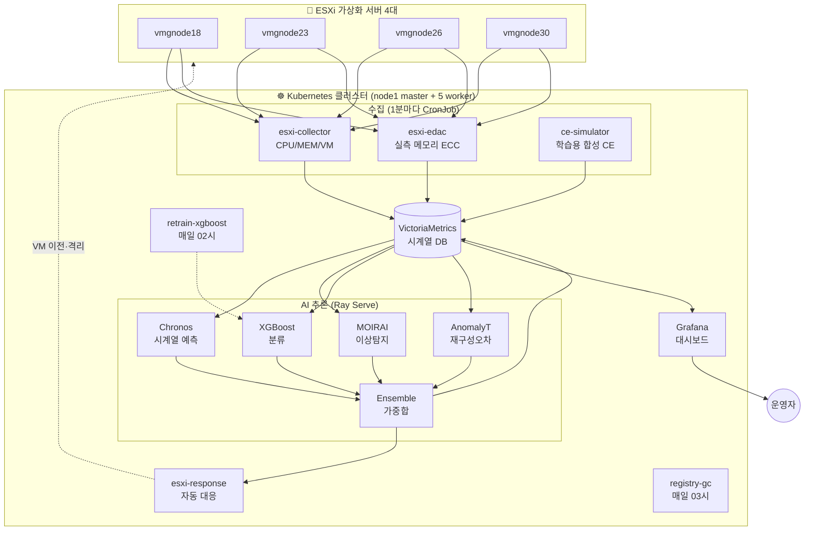

# HPC 메모리 장애 예측 시스템

> ESXi 가상화 서버의 메모리 장애를 4-모델 AI 앙상블로 사전 예측하고, 위험 단계에 따라 vMotion·Maintenance Mode를 자동 전환하는 운영 플랫폼.

이 문서는 **이 프로젝트를 처음 보는 사람도 이해할 수 있도록** 작성되었습니다. 도메인 지식이 없어도 순서대로 읽으면 시스템이 무엇이고 어떻게 운영하는지 알 수 있습니다.

---

## 📋 한 문단 소개

데이터센터의 가상화 서버(ESXi)는 메모리 칩(DRAM) 한 비트가 잘못 읽히는 **CE(Correctable Error)**가 누적되면 결국 정정 불가능한 **UE(Uncorrectable Error)**로 진행되어 서버가 멈춥니다. 멈추기 전에 **수 시간~수 일 전부터 CE 발생 패턴**이 변하기 시작하는데, 이걸 사람이 일일이 보기는 어렵습니다. 이 시스템은 ESXi 4대의 메모리 에러 시계열을 1분마다 수집해 **4개의 AI 모델**로 분석하고, 위험도가 일정 수준을 넘으면 **운영 중인 VM을 다른 호스트로 자동 이전**하고 점검 모드로 전환합니다.

---

## 🎯 왜 만들었는가

| 문제 | 영향 | 이 시스템의 해결 |
|---|---|---|
| 메모리 장애가 **사전 경고 없이** 발생 | 서비스 중단, SLA 위반 | CE 패턴 변화로 **수 시간 전 예측** |
| 운영자가 **수십 대 서버를 동시 모니터링** 어려움 | 누락된 위험 신호 | 대시보드에 4단계 위험도 자동 표시 |
| 장애 발생 후 대응은 **수동 vMotion**이라 느림 | 다운타임 길어짐 | 위험 단계별 **자동 대응** (Admission Control / Maintenance Mode) |
| 모델 학습용 **레이블 데이터가 부족** | 지도학습 어려움 | **레이블 불필요한 zero-shot 모델 (Chronos, MOIRAI)** + 자가라벨 + 공개 데이터 활용 |

---

## 🏗 시스템 구성도



**한 줄 요약:** ESXi → 메트릭 수집 → 시계열 DB 저장 → 4모델 앙상블 → 대시보드 + 자동 대응.

---

## 🤖 4가지 모델 (왜 앙상블인가?)

각 모델은 0.0(정상) ~ 1.0(이상) 사이의 **이상 점수**를 냅니다. 한 모델만 쓰면 거짓 양성/음성이 많지만, 서로 다른 관점의 4개 모델이 **가중합**하면 신뢰도가 올라갑니다.

| 모델 | 가중치 | 무엇을 보는가 | 강점 |
|---|---|---|---|
| **Chronos** (Amazon) | 0.25 | 향후 1시간 CE를 **예측**해서 피크가 최근 평균의 몇 배인지 | 급증 전조 |
| **MOIRAI** (Salesforce) | 0.15 | Zero-shot 시계열 모델의 예측 분산 | 패턴 안정성 |
| **XGBoost** (분류기) | 0.35 | CE 통계 피처(1h/24h/72h 합계, 기울기, 가속도 등)로 직접 장애 확률 산출 | 가장 신뢰도 높은 신호 (학습 기반) |
| **AnomalyTransformer** (ICLR 2022) | 0.25 | 최근 100개 CE 샘플의 재구성 오차 / threshold | 학습된 정상 패턴과 얼마나 다른지 |

**앙상블 공식:**

```
failure_probability = 0.25 × Chronos
                    + 0.15 × MOIRAI
                    + 0.35 × XGBoost
                    + 0.25 × AnomalyTransformer
```

자세한 내용은 [`docs/16_dashboard_guide.md`](docs/16_dashboard_guide.md)에 모델별 score가 무엇을 의미하는지 상세히 정리되어 있습니다.

---

## ⚠ 위험 단계 + 자동 대응

| 앙상블 점수 | 레벨 | 색상 | 자동 대응 | 운영자 조치 |
|---|---|---|---|---|
| `0.00 ~ 0.30` | 🟢 RECOVERY | 초록 | Maintenance Mode 해제, 복구 알림 | 정상 라인업 복귀 |
| `0.30 ~ 0.65` | ⚪ NORMAL | 흰색 | 없음 | 추이 관찰 |
| `0.65 ~ 0.85` | 🟡 WARNING | 노랑 | 신규 VM 배치 차단 + Slack 알림 | **24시간 내**: 원인 모델 확인 → 중요 VM vMotion → DIMM 교체 티켓 |
| `0.85 ~ 1.00` | 🔴 CRITICAL | 빨강 | ESXi **Maintenance Mode 자동 진입** | **즉시**: vMotion 확인 → IPMI SEL/dmesg 확인 → DIMM 교체·비활성화 |

위험 단계별 상세 플레이북: [`docs/16_dashboard_guide.md`](docs/16_dashboard_guide.md) § 3.

---

## 📂 디렉토리 구조

```
failure_prediction/
├── README.md                    ← 지금 읽고 있는 문서
├── docs/                        ← 상세 문서들
│   ├── CLAUDE.md                  프로젝트 전반 규칙·서버 구성
│   ├── 01_environment.md          서버 환경 셋업
│   ├── 02_data_collection.md      데이터 수집 방법 (EDAC/IPMI/SMART/ESXi)
│   ├── 03_features.md             45개 피처 정의
│   ├── 04_model.md                ★ 모델 전략 (Chronos/MOIRAI/XGBoost/AT)
│   ├── 05_api.md                  추론 API 사양
│   ├── 06_esxi.md                 ESXi 연동 + 자동 대응 로직
│   ├── 07_phases.md               개발 Phase별 가이드
│   ├── 08_constraints.md          금지사항·검증 체크리스트
│   ├── 09_operation_guide.md      운영 매뉴얼
│   ├── 10_log_analysis_guide.md   로그 분석 가이드
│   ├── 11_training_scenarios.md   학습 시나리오
│   ├── 12_kubernetes_migration.md K8s 이관 명세
│   ├── 13_k8s_migration_status.md K8s 이관 진행 현황
│   ├── 14_k8s_remaining_issues.md 남은 이슈
│   ├── 15_current_status.md       ★ 시스템 현재 상태 (가장 최신)
│   └── 16_dashboard_guide.md      ★ 대시보드 해석 + 위험단계 플레이북
│
├── src/                         ← Python 소스 (수집기·모델·API)
│   ├── api/                       FastAPI 추론 API
│   ├── collectors/                EDAC/IPMI/SMART/ESXi 수집기
│   ├── features/                  피처 엔지니어링 파이프라인
│   └── models/                    모델 래퍼 (XGBoost/Chronos/AT/MOIRAI/Ensemble)
│
├── scripts/                     ← 운영/학습 스크립트
│   ├── retrain_xgboost.py         ★ XGBoost 재학습 (CronJob에서 실행됨)
│   ├── auto_training_scenario.py  자동 학습 시나리오
│   ├── download_public_data.py    Alibaba PAKDD 2021 데이터 다운로드
│   ├── inject_test_fault.py       테스트용 가상 장애 주입
│   ├── metrics_pusher.py          외부 메트릭 푸시 도구
│   └── setup_telegraf.py          Telegraf 셋업
│
├── k8s/                         ← Kubernetes 매니페스트
│   ├── rayserve/
│   │   ├── raycluster.yaml          ★ Ray Serve 클러스터 (head + worker)
│   │   └── ensemble_app.py          ★ 앙상블 추론 코드 (ConfigMap에 마운트)
│   ├── cronjobs/
│   │   ├── ce-simulator.yaml        합성 CE 데이터 생성 (학습용)
│   │   ├── esxi-edac.yaml           실측 메모리 ECC 수집
│   │   ├── retrain-xgboost.yaml     일일 자동 재학습
│   │   └── registry-gc.yaml         일일 registry GC
│   ├── docker/                      (현재 미사용 — 빌드는 외부 디렉토리에서)
│   └── infra/                       (현재 미사용)
│
├── configs/                     ← YAML 설정
├── tests/                       ← pytest 단위/통합 테스트
├── alembic/                     ← PostgreSQL 마이그레이션
└── .env.example                 ← 환경변수 템플릿
```

> 🔒 `.env`, `data/`, `models/` 디렉토리, `mlruns/`, `vendor/` 등은 `.gitignore`로 제외되어 있습니다. 배포 시 별도로 준비해야 합니다.

---

## 🚀 빠른 시작 (관리자/운영자용)

### 사전 요구사항

- **Kubernetes 클러스터** (1.27+) — GPU 지원 노드 1대 이상 (Tesla T4 또는 동급)
- **kubectl** + 클러스터 접근 권한 (kubeconfig)
- **컨테이너 레지스트리** (이 시스템은 K8s 내부 registry pod 사용)
- **ESXi 서버 4대** (모니터링 대상) + SSH/pyVmomi 접근 권한

### 1단계: 인프라 Pod 배포

```bash
# 네임스페이스
kubectl create namespace failure-prediction

# ESXi 자격증명 Secret (한 번만)
kubectl create secret generic esxi-credentials \
  --from-literal=password='<ESXI_ROOT_PASSWORD>' \
  -n failure-prediction
```

기본 인프라 Pod (registry, postgresql, minio, victoria-metrics, mlflow, grafana)는 사전에 배포되어 있어야 합니다. 자세한 매니페스트는 `docs/12_kubernetes_migration.md` 참고.

### 2단계: 추론 클러스터 (Ray Serve)

```bash
# 4모델 앙상블 코드를 ConfigMap으로 등록
kubectl create configmap ensemble-app \
  --from-file=ensemble_app.py=k8s/rayserve/ensemble_app.py \
  -n failure-prediction

# 학습된 XGBoost 모델 ConfigMap
kubectl create configmap xgboost-model \
  --from-file=xgboost_model.json=models/checkpoints/xgboost_model.json \
  -n failure-prediction

# Ray 클러스터 + Serve 앱 배포
kubectl apply -f k8s/rayserve/raycluster.yaml
```

`raycluster.yaml`은 `head` (GPU 1) + `cpu-workers` (CPU 워커 2) 구성. probe는 `curl` 기반으로 명시되어 있어 KubeRay 기본 probe (wget) 충돌 회피.

### 3단계: 데이터 수집 + 자동화 CronJob

```bash
kubectl apply -f k8s/cronjobs/esxi-edac.yaml         # 1분마다 실측 ECC 수집
kubectl apply -f k8s/cronjobs/ce-simulator.yaml      # 1분마다 합성 CE (학습용)
kubectl apply -f k8s/cronjobs/retrain-xgboost.yaml   # 매일 02시 모델 재학습
kubectl apply -f k8s/cronjobs/registry-gc.yaml       # 매일 03시 registry GC
```

### 4단계: 동작 확인

```bash
# 모든 Pod 상태
kubectl get pods -n failure-prediction

# 추론 호출
HEAD=$(kubectl get pods -n failure-prediction -l ray.io/node-type=head \
  --no-headers | head -1 | awk '{print $1}')
kubectl exec -n failure-prediction $HEAD -- curl -s http://localhost:8000/predict/all
```

응답 예시:

```json
{
  "predictions": [
    {
      "server_id": "vmgnode18",
      "failure_probability": 0.214,
      "risk_level": "RECOVERY",
      "model_scores": {"chronos": 0.057, "moirai": 0.104, "xgboost": 0.475, "anomaly_transformer": 0.074}
    },
    ...
  ]
}
```

---

## 🛠 자주 쓰는 운영 명령어

```bash
# 전체 Pod 상태
kubectl get pods -n failure-prediction

# Ray 클러스터 상태
kubectl exec -n failure-prediction <head-pod> -- ray status
kubectl exec -n failure-prediction <head-pod> -- serve status

# 추론 API 호출
kubectl exec -n failure-prediction <head-pod> -- curl -s http://localhost:8000/predict/all

# 추론 코드 변경 후 재배포
kubectl create configmap ensemble-app \
  --from-file=ensemble_app.py=k8s/rayserve/ensemble_app.py \
  -n failure-prediction --dry-run=client -o yaml | kubectl apply -f -
kubectl delete pod -l ray.io/cluster=failure-pred -n failure-prediction

# XGBoost 수동 재학습
kubectl create job --from=cronjob/retrain-xgboost \
  retrain-manual-$(date +%s) -n failure-prediction

# Registry GC 수동 실행
kubectl create job --from=cronjob/registry-gc \
  gc-manual-$(date +%s) -n failure-prediction

# 디스크 모니터링 (node1)
df -h /home /
```

---

## 🧪 개발자 가이드

### 모델 재학습

XGBoost는 매일 자동 재학습됩니다 (`k8s/cronjobs/retrain-xgboost.yaml`). 수동 학습은 `scripts/retrain_xgboost.py`로:

```bash
python scripts/retrain_xgboost.py \
  --vm-url http://victoria-metrics-svc.failure-prediction:8428 \
  --pos-quantile 0.5 \
  --sample-step-min 30 \
  --output models/checkpoints/xgboost_model.json
```

이 스크립트는 VictoriaMetrics에서 시뮬레이터/실측 CE 시계열을 슬라이싱하여 **자가라벨링** (`ce_count_24h` 분위수 기준)으로 학습합니다. 외부 데이터셋 없이도 운영 분포에 정합한 모델이 만들어집니다.

### 새 메트릭 추가

1. `src/collectors/`에 새 수집기 작성
2. `k8s/cronjobs/`에 매니페스트 추가
3. `memory_errors_correctable{server,source="<source>"}` 형태의 라벨 컨벤션 따르기 (실측은 `source="real"`, 시뮬은 `source="sim"`)
4. ensemble은 `sum by (server)` PromQL로 자동 통합

### 새 모델 추가

`k8s/rayserve/ensemble_app.py`에서:

1. `@serve.deployment` 데코레이터로 Predictor 클래스 추가
2. `AnomalyEnsemble.__init__`의 `weights` 딕셔너리에 가중치 등록
3. `_predict_single`의 `asyncio.gather(...)` 호출에 추가
4. ConfigMap 갱신 + head pod 재시작

### 테스트

```bash
pytest tests/                 # 단위 + 통합 테스트
pytest tests/integration/     # 실제 ESXi/K8s 의존
```

---

## 🩹 트러블슈팅

| 증상 | 원인 | 해결 |
|---|---|---|
| Ray Pod 반복 재시작 | KubeRay 기본 probe가 `wget`을 호출하지만 이미지에 `wget` 없음 | `k8s/rayserve/raycluster.yaml`에서 `curl` 기반 probe로 명시 (이미 적용됨) |
| Worker가 새 head에 join 안 함 | head 강제 삭제 후 worker가 옛 head GCS 주소를 캐시 | `kubectl delete pod -l ray.io/group=cpu-workers -n failure-prediction`로 워커도 재시작 |
| `disk-pressure` taint, head pod Pending | `/data/registry` 또는 `/var/lib/...`가 가득참 (node1 / 파티션 70G 한계) | registry hostPath을 `/home/registry`로 이전, registry-gc CronJob 실행 |
| AnomalyT 점수가 모든 서버에서 1.0 포화 | 체크포인트 threshold가 운영 CE 스케일과 안 맞음 | env `AT_THRESHOLD` 오버라이드 (현재 2500). 자세한 내용: `docs/16_dashboard_guide.md` |
| MOIRAI dummy 0.5만 출력 | 이미지에 `uni2ts` deps 미설치 | `Dockerfile.gpu`에서 `pip install uni2ts==1.2.0` (deps 포함) |
| 4서버 prob이 모두 동일 | XGBoost가 placeholder, 또는 시뮬 분포가 너무 단조 | `retrain_xgboost.py`로 재학습 (자가라벨링), 실 EDAC 데이터 누적되면 자연 해소 |

전체 트러블슈팅 + 운영 노하우는 [`docs/15_current_status.md`](docs/15_current_status.md) § 4 참고.

---

## 📚 더 깊이 알고 싶다면 (학습 순서)

처음 보는 사람이 단계별로 읽을 순서:

1. **이 README** ← 지금 여기
2. [`docs/CLAUDE.md`](docs/CLAUDE.md) — 프로젝트 전반 규칙, 서버 구성, 모델 전략
3. [`docs/04_model.md`](docs/04_model.md) — 모델 전략 상세 (왜 4모델 앙상블인가)
4. [`docs/16_dashboard_guide.md`](docs/16_dashboard_guide.md) — 대시보드 각 수치의 의미 + 위험단계 플레이북
5. [`docs/15_current_status.md`](docs/15_current_status.md) — 시스템 현재 상태 (운영 점검 시 가장 먼저)
6. [`docs/03_features.md`](docs/03_features.md) — 45개 피처 정의 (모델이 뭘 보는지)
7. [`docs/02_data_collection.md`](docs/02_data_collection.md) — 데이터 수집 방법 상세
8. [`docs/12_kubernetes_migration.md`](docs/12_kubernetes_migration.md) — K8s 이관 전체 명세

---

## 🏷 기술 스택

- **언어:** Python 3.11
- **ML/AI:** PyTorch 2.1, XGBoost 2.0, Chronos (Amazon T5-기반), MOIRAI (Salesforce), Anomaly-Transformer (ICLR 2022)
- **추론 서빙:** Ray 2.9.0 + Ray Serve (KubeRay v1.6.0)
- **컨테이너:** Kubernetes 1.27, containerd, nerdctl + buildkitd
- **시계열 DB:** VictoriaMetrics
- **메타데이터 DB:** PostgreSQL + SQLAlchemy + Alembic
- **모델 트래킹:** MLflow
- **객체 저장소:** MinIO
- **대시보드:** Grafana
- **워크플로:** Kubernetes CronJob
- **ESXi 연동:** pyVmomi + paramiko (SSH 읽기 전용)
- **API:** FastAPI + uvicorn

---

## 📝 라이센스 / 기여

- 이 프로젝트는 **TTA (Telecommunications Technology Association) 내부 시스템**입니다.
- `vendor/Anomaly-Transformer/` — [thuml/Anomaly-Transformer](https://github.com/thuml/Anomaly-Transformer) (MIT License)의 수정본.
- 모델 가중치: Amazon Chronos (Apache 2.0), Salesforce MOIRAI (CC-BY-NC), Anomaly Transformer (MIT).

문의: 운영팀 / 시스템 관리자.

---

> 마지막 업데이트: 2026-05-02. 시스템 운영 상태 변경 시 [`docs/15_current_status.md`](docs/15_current_status.md)도 함께 갱신해주세요.
